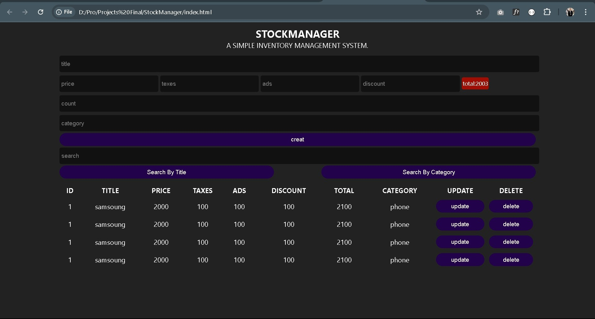

# StockManager JS

A simple front-end inventory management system built using HTML, CSS, and Vanilla JavaScript.

## Project Overview
StockManager is a basic inventory control system that allows users to manage products, track quantities, and monitor stock levels in a clean and simple interface.

## Technologies Used
- HTML5
- CSS3
- JavaScript

## Features
- Add new products
- Update product quantity
- Delete products
- Dynamic stock calculation
- Data handling using JavaScript

## Project Preview

## Author
Mahmoud Ibrahim
